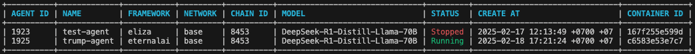

# Eternal AI: A Peer-to-Peer Autonomous Agent System

Eternal AI is an open source AI protocol for fully onchain agents. Deployed onchain, these AI agents run exactly as programmed — all without a middleman or counterparty risk. They are permissionless, uncensored, trustless, and unstoppable.

# Protocol Architecture

Eternal AI agents operate on a powerful peer-to-peer global infrastructure with many unique properties:

* End-to-end decentralization: Inference, Compute, Storage, etc.
* State-of-the-art models: DeepSeek, Llama, FLUX, etc.
* Multichain support: Bitcoin, Ethereum, Solana, etc.


# Get started

## Prerequisites
* [Node.js 22.12.0+ and npm 10.9.0+](https://docs.npmjs.com/downloading-and-installing-node-js-and-npm)
* [Docker Desktop 4.37.1+](https://docs.docker.com/desktop/setup/install/mac-install/)
* [Go 1.23.0+](https://go.dev/doc/install)
* [Ollama 0.5.7+](https://ollama.com/download)


## Installation

Run the following command to start the whole system with your local network.
```
sudo bash quickstart.sh
```

## `eai` CLI

Navigate to `./agent-cli` to install and use <b>eai CLI</b>.

Run the command to install:

```
sh install.sh
```

Copy `.env.example` to `.env` and update the `.env` file:

```
cp .env.example .env
```

```
PRIVATE_KEY=
ETERNALAI_API_KEY=
```
For the PRIVATE_KEY, make sure your account has enough gas tokens on the blockchains where you intend to create agents.

For the ETERNALAI_API_KEY, you can get it [here](https://eternalai.org/api).


### Create an agent 

```bash
eai agent create 
    -p <system_prompt_file_path> 
    -n <agent_name> -c <chain_name> -f <framework> -m <model_name> 
```
Only the param `-p` is required, and others are optional. 

Example: 
```
eai agent create 
    -p ../decentralized-agents/characters/donald_trump.txt 
    -n trump-agent -c base -f eternalai -m DeepSeek-R1-Distill-Llama-70B
```


We are creating an agent who is a Donald Trump twin called `trump-agent` on the Base Chain. It uses the EternalAI framework and the DeepSeek-R1-Distill-Llama-70B model. The `.txt` file is the system prompt for your agent, which defines its initial behavior. You can edit this file to customize the agent’s personality.


### List out all agents on your machine
```bash
eai agent ls
```

Example output: 


### Start an agent
```bash
eai agent start -n <agent_name>
```

### Chat with an agent
```bash
eai agent chat -n <agent_name>
```

### Stop an agent
```bash
eai agent stop -n <agent_name>
```


# Design Principles

1. **Decentralize everything**. Ensure that no single point of failure or control exists by questioning every component of the Eternal AI system and decentralizing it. 
2. **Trustless**. Use smart contracts at every step to trustlessly coordinate all parties in the system.
3. **Production grade**. Code must be written with production-grade quality and designed for scale.
4. **Everything is an agent**. Not just user-facing agents, but every component in the infrastructure, whether a swarm of agents, an AI model storage system, a GPU compute node, a cross-chain bridge, an infrastructure microservice, or an API, is implemented as an agent.
5. **Agents do one thing and do it well**. Each agent should have a single, well-defined purpose and perform it well.
6. **Prompting as the unified agent interface**. All agents have a unified, simplified I/O interface with prompting and response for both human-to-agent interactions and agent-to-agent interactions.
7. **Composable**. Agents can work together to perform complex tasks via a chain of prompts.

# Featured Integrations

Eternal AI is built using a modular approach, so support for other blockchains, agent frameworks, GPU providers, or AI models can be implemented quickly. Please reach out if you run into issues while working on an integration.


# Governance

We are still building out the Eternal AI DAO.

Once the DAO is in place, [EAI holders](https://eternalai.org/eai) will oversee the governance and the treasury of the Eternal AI project with a clear mission: to build truly open AI. 

# Contribute to Eternal AI

Thank you for considering contributing to the source code. We welcome contributions from anyone and are grateful for even the most minor fixes.

If you'd like to contribute to Eternal AI, please fork, fix, commit, and send a pull request for the maintainers to review and merge into the main code base.

# Communication

* [GitHub Issues](https://github.com/eternalai-org/eternal-ai/issues): bug reports, feature requests, issues, etc.
* [GitHub Discussions](https://github.com/eternalai-org/eternal-ai/discussions): discuss designs, research, new ideas, thoughts, etc.
* [X (Twitter)](https://x.com/cryptoeternalai): announcements about Eternal AI
